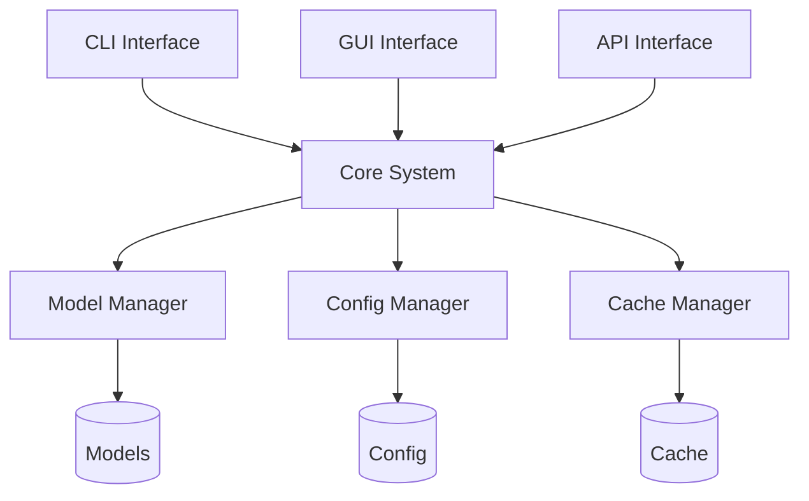

# LlamaHome

A comprehensive environment for running, training, and optimizing Llama models with advanced features and optimizations.

## Features

### Core Capabilities

- 🚀 Optimized Llama model inference
- 🔄 Efficient context window management
- 💾 Smart caching and resource management
- 🎯 High-performance training pipeline
- 🔧 Advanced configuration system
- 📊 Comprehensive monitoring

### Key Integrations

- 🔥 llama-recipes integration
- 💫 H2O optimization support
- 🔌 Extensible plugin system
- 🌐 RESTful API interface
- 🖥️ CLI and GUI interfaces

## Quick Start

### Prerequisites

- Python 3.11
- CUDA-capable GPU (for GPU acceleration)
- 16GB+ RAM (32GB+ recommended)
- 50GB+ storage space

### Installation

1. **Clone Repository**
   ```bash
   git clone https://github.com/zachshallbetter/llamahome.git
   cd llamahome
   ```

2. **Setup Environment**
   ```bash
   # Install Poetry
   curl -sSL https://install.python-poetry.org | python3 -

   # Install dependencies
   make setup
   ```

3. **Configure Environment**
   ```bash
   # Copy example configuration
   cp .env.example .env
   
   # Edit configuration
   nano .env
   ```

### Basic Usage

1. **Start CLI Interface**
   ```bash
   make run
   ```

2. **Process Text**
   ```python
   from llamahome import LlamaHome
   
   app = LlamaHome()
   result = await app.process("Summarize this text")
   print(result)
   ```

3. **Train Model**
   ```bash
   make train DATA_PATH=/path/to/data
   ```

## Architecture

### System Components



### Key Components

1. **Core System**
   - Central orchestration
   - Request handling
   - Resource management
   - Error handling

2. **Model Management**
   - Model lifecycle
   - Resource optimization
   - Performance monitoring
   - Cache management

3. **Configuration System**
   - Dynamic configuration
   - Environment management
   - Validation system
   - Plugin support

## Configuration

### Basic Configuration

```yaml
# config/model_config.yaml
models:
  llama3.3:
    version: "3.3"
    variants:
      - "7b"
      - "13b"
      - "70b"
    context_length: 32768
    optimization:
      quantization: "int8"
      gpu_layers: 32
```

### Advanced Settings

```yaml
# config/system_config.yaml
system:
  log_level: INFO
  cache_size: 10GB
  max_memory: 90%

performance:
  batch_size: 32
  num_workers: 4
  timeout: 30

security:
  enable_auth: true
  token_expiry: 3600
  max_requests: 1000
```

## Development

### Setup Development Environment

1. **Install Dependencies**
   ```bash
   make setup-dev
   ```

2. **Run Tests**
   ```bash
   make test
   ```

3. **Check Code Style**
   ```bash
   make lint
   ```

### Contributing

1. Fork the repository
2. Create your feature branch
3. Commit your changes
4. Push to the branch
5. Create a Pull Request

## Documentation

### Core Documentation

- [Architecture Guide](docs/Architecture.md)
- [API Reference](docs/API.md)
- [Configuration Guide](docs/Config.md)
- [Development Guide](docs/Development.md)

### Additional Resources

- [Performance Guide](docs/Performance.md)
- [Security Guide](docs/Security.md)
- [Testing Guide](docs/Testing.md)
- [Contributing Guide](docs/Contributing.md)

## Performance

### Hardware Requirements

1. **Minimum Requirements**
   - CPU: 4 cores, 2.5GHz+
   - RAM: 16GB
   - Storage: 50GB SSD
   - GPU: 8GB VRAM (for 7B model)

2. **Recommended Requirements**
   - CPU: 8+ cores, 3.5GHz+
   - RAM: 32GB
   - Storage: 100GB NVMe SSD
   - GPU: 24GB VRAM (for 13B model)

3. **High Performance Requirements**
   - CPU: 16+ cores, 4.0GHz+
   - RAM: 64GB+
   - Storage: 500GB NVMe SSD
   - GPU: 80GB VRAM (for 70B model)

### Optimization Features

1. **Memory Optimization**
   - Smart caching
   - Resource pooling
   - Memory-mapped files
   - Garbage collection

2. **Performance Features**
   - Batch processing
   - Async operations
   - GPU acceleration
   - H2O optimization

## Security

### Security Features

1. **Authentication**
   - Token-based auth
   - Role-based access
   - Session management
   - Audit logging

2. **Resource Protection**
   - Rate limiting
   - Resource quotas
   - Input validation
   - Output sanitization

## Support

### Getting Help

1. **Documentation**
   - [User Guide](docs/User.md)
   - [FAQ](docs/FAQ.md)
   - [Troubleshooting](docs/Troubleshooting.md)

2. **Community**
   - [GitHub Issues](https://github.com/zachshallbetter/llamahome/issues)
   - [Discussions](https://github.com/zachshallbetter/llamahome/discussions)

## License

This project is licensed under the MIT License - see the [LICENSE](LICENSE) file for details.

## Acknowledgments

- [llama-recipes](https://github.com/facebookresearch/llama-recipes) for model optimization
- [H2O.ai](https://h2o.ai/) for performance optimization
- All contributors and community members

## Roadmap

### Upcoming Features

1. **Short Term**
   - Enhanced GPU optimization
   - Improved cache management
   - Extended API capabilities
   - Additional model support

2. **Long Term**
   - Distributed training
   - Cloud integration
   - Advanced monitoring
   - Extended plugin system

## Contributing

We welcome contributions! Please see our [Contributing Guide](docs/Contributing.md) for details.

## Code of Conduct

Please read our [Code of Conduct](CODE_OF_CONDUCT.md) before contributing.
