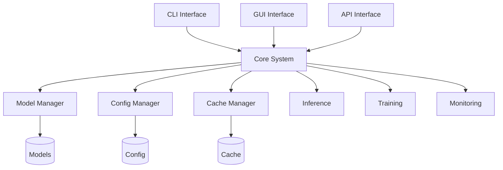

# LlamaHome

LlamaHome is a comprehensive environment for developers, researchers, and organizations looking to work with large language models (LLMs) on consumer hardware. Specifically optimized for the Llama model family, it makes enterprise-grade LLM development accessible to teams with limited computational resources. Through advanced memory management and performance optimization techniques, LlamaHome enables you to run, fine-tune, and deploy large language models that would traditionally require expensive infrastructure.

## What It Does

LlamaHome combines two powerful components into a hybrid system that makes working with large language models more practical and efficient:

1. **llama-recipes**: Provides the foundation for model optimization and training, enabling features like LoRA fine-tuning, FP16 training, and efficient checkpointing. This allows you to customize and improve models while maintaining performance.
   - LoRA fine-tuning adapts models to specific tasks or domains to fractionalize the fine-tuning memory requirements.
   - FP16 training used to reduce memory usage using half-precision numbers without significant accuracy loss
   - Efficient checkpointing maintains training progress by saving model states without excessive storage overhead

2. **H2O (Heavy-Hitter Oracle)**: An innovative attention mechanism from [H2O.ai](https://www.h2o.ai/) that identifies and maintains only the most critical key-value pairs, enabling processing of sequences up to 32K tokens while reducing memory usage by up to 50%. This breakthrough makes it possible to work with longer sequences even on hardware with limited resources. Key features include:
   - Heavy-hitter estimation for identifying important attention patterns
   - Efficient memory management and garbage collection
   - Automatic resource scaling and optimization
   - Distributed computing capabilities for larger workloads
   - Real-time performance monitoring and adjustment

## Why It Matters

Running large language models traditionally requires significant computational resources, making them impractical for many use cases. Local deployment offers several critical advantages:

- **Data Privacy & Security**: Keep sensitive data within your infrastructure instead of sending it to external APIs
- **Cost Control**: Eliminate per-token API charges and maintain predictable infrastructure costs
- **Customization**: Fine-tune models for specific domains or tasks without dependency on cloud providers
- **Latency**: Reduce response times by eliminating network overhead
- **Reliability**: Maintain service even without internet connectivity
- **Integration**: Directly integrate with existing systems and workflows

LlamaHome makes these benefits accessible by solving key technical challenges:

1. **Memory Management**: Traditional approaches require massive amounts of RAM and VRAM:
   - A 7B parameter model typically needs 14GB+ RAM for basic inference
   - Processing long sequences (32K tokens) can require 50GB+ RAM
   - Fine-tuning traditionally needs 2-3x these requirements

   Our hybrid approach with H2O reduces these requirements by up to 50%, making enterprise-grade models practical on consumer hardware.

2. **Training Accessibility**: Fine-tuning typically requires enterprise-grade infrastructure. Our implementation:
   - Uses LoRA to reduce memory requirements by up to 90%
   - Enables training on consumer GPUs (even 8GB VRAM)
   - Maintains model quality while reducing resource needs

3. **Practical Usability**: We've simplified deployment and management:
   - CLI, GUI, and API interfaces for different workflows
   - Automated resource management and optimization
   - Built-in monitoring and performance tools
   - Comprehensive documentation and examples

## How It Works

LlamaHome combines three main interfaces (CLI, GUI, and API) with a core system that manages models, configurations, and caching. This structure makes it simple to work with large language models through whichever interface best suits your needs:



### Model Management
The system handles the complete lifecycle of models through a combination of two powerful components into a hybrid system that makes working with large language models more practical and efficient:

1. **Model Downloads and Storage**
```bash
# Download base model
llamahome download llama-3.3-7b

# Show model info
llamahome info llama-3.3-7b

# List available models
llamahome list
```

Models are configured through TOML files:
```toml
# models.toml
llama:
  versions:
    "3.3-7b":
      url: "https://example.com/llama-3.3-7b"
      size: "7B"
      type: "base"
      format: "meta"
      compatibility:
        python: ">=3.11"
        cuda: ">=11.7"
```

2. **Storage Structure**
```text
data/
├── models/              # Model storage
│   ├── base/           # Base models
│   │   └── llama/      # Llama models
│   └── fine-tuned/     # Fine-tuned models
└── configs/            # Model configurations
```

3. **Resource Management**
- Automatic cache cleanup and size management
- Version-specific configurations
- Compatibility tracking
- Checksum verification for downloads
- Access control and integrity checks

For detailed information about model management and configuration options, see:
- [Model Configuration Guide](docs/Models.md) for complete setup
- [Storage Management](docs/Models.md#storage-management) for organization details
- [Security Considerations](docs/Models.md#security) for best practices

### Cache Management
The system optimizes memory usage through:
1. Analyzing attention patterns to identify critical information
2. Maintaining only essential key-value pairs in memory
3. Dynamically managing cache size based on available resources
4. Optimizing GPU memory allocation for maximum efficiency

### Configuration Management
Configuration is handled through:
- TOML files for model and system settings
- Environment variables for runtime settings
- Command-line arguments for immediate changes

### Training Pipeline
The training system provides a comprehensive environment for fine-tuning large language models. Key features include:

```bash
# Start training with default configuration
make train DATA_PATH=data/training/dataset.jsonl

# Resume from checkpoint
make train-resume CHECKPOINT=checkpoints/checkpoint-1000

# Distributed training across GPUs
make train-distributed WORLD_SIZE=4 CONFIG=configs/distributed.toml
```

The pipeline integrates several components:

1. **Data Management**
   - Efficient data loading and preprocessing
   - Dynamic batching and caching
   - Distributed data sampling

2. **Model Optimization**
   - Hybrid attention mechanism
   - Gradient accumulation and clipping
   - Memory-efficient training
   - Automatic mixed precision

3. **Monitoring System**
   - Real-time metrics collection
   - Performance monitoring
   - Resource tracking
   - Interactive visualizations

4. **Distributed Training**
   - Multi-GPU synchronization
   - Gradient aggregation
   - Checkpoint management
   - Process coordination

Configuration is handled through TOML files:
```toml
# training_config.toml
training:
  batch_size: 32
  learning_rate: 1e-4
  warmup_steps: 100
  gradient_accumulation_steps: 4
  max_grad_norm: 1.0
```

For detailed information about training capabilities and configuration options, see:
- [Training Guide](docs/Training.md) for complete setup and usage
- [Data Processing Guide](docs/Data.md) for data preparation
- [Performance Guide](docs/Performance.md) for optimization tips

### Memory Optimization
The H2O system revolutionizes memory usage by:
1. Analyzing attention patterns to identify critical information
2. Maintaining only essential key-value pairs in memory
3. Dynamically managing cache size based on available resources
4. Optimizing GPU memory allocation for maximum efficiency

### Interface Options
Choose the interface(s) that fit your workflow:
- CLI: See [CLI.md](docs/CLI.md) for automation and scripting with a powerful command-line interface
- GUI: See [GUI.md](docs/GUI.md) for interactive development with a user-friendly graphical interface
- API: See [API.md](docs/API.md) for programmatic integration with RESTful endpoints and WebSocket support

For detailed information about each component, refer to:
- [Architecture Guide](docs/Architecture.md) for system design details, including:
  - Core system architecture and components
  - Request/response flow and system states
  - Model, cache, and configuration management
  - Interface and plugin systems
  - Performance optimization strategies
- [API Reference](docs/API.md) for integration options, covering:
  - REST API endpoints and WebSocket support
  - Authentication and security
  - Rate limiting and error handling
  - Client libraries and examples
- [Configuration Guide](docs/Config.md) for setup options, including:
  - Environment configuration
  - Model settings and optimization
  - Resource management
  - Cache configuration
  - Security settings
- [Development Guide](docs/Development.md) for extending the system, with:
  - Plugin development guidelines
  - Custom integration examples
  - Testing and debugging tips
  - Contributing workflow

Additional resources:
- [Performance Guide](docs/Performance.md) for optimization tips on:
  - Memory management and streaming data pipelines
  - Resource utilization and monitoring
  - Training optimization and batch processing
  - Cache management and tiered caching
- [Security Guide](docs/Security.md) for security considerations including:
  - Authentication and access control
  - Data protection and encryption
  - Security monitoring and logging
  - Incident response procedures
- [Testing Guide](docs/Testing.md) for validation procedures covering:
  - Unit, integration and performance testing
  - Test data management and fixtures
  - CI/CD integration and debugging
  - Test coverage and maintenance
- [FAQ](docs/FAQ.md) for answers to common questions about:
  - Installation and configuration
  - Model management and optimization
  - Performance tuning and monitoring
  - Troubleshooting and development
- [Contributing Guide](docs/Contributing.md) for development guidelines

## Getting Started

### Prerequisites

- Python 3.11
- CUDA-capable GPU (for GPU acceleration)
- 16GB+ RAM (32GB+ recommended)
- 50GB+ storage space
- Trunk CLI
- Poetry
- Git

### Why Trunk?

[Trunk](https://docs.trunk.io/cli) is used for code quality assurance and development workflow automation. In LlamaHome, we use it for:

1. **Code Quality**
   - Automated linting and formatting
   - Pre-commit checks
   - Consistent code style across contributors

2. **Development Tools**
   - Hermetic runtime management
   - CLI tool versioning
   - Consistent development environment

3. **Workflow Automation**
   - Git hooks management
   - Local development automation
   - CI/CD integration

To initialize Trunk in your environment:
```bash
trunk init
```

### Why Poetry?

[Poetry](https://python-poetry.org/docs/) is our chosen dependency management and packaging tool because it provides:

1. **Dependency Management**
   - Precise dependency resolution
   - Lock file for reproducible installations
   - Virtual environment management
   - Easy dependency updates and conflict resolution

2. **Project Packaging**
   - Standardized project structure
   - Built-in build system
   - Package publishing tools
   - PEP 517/518 compliance

3. **Development Workflow**
   - Isolated development environments
   - Easy dependency addition/removal
   - Script management
   - Environment consistency across team members

To set up Poetry in your environment:
```bash
# Install Poetry
curl -sSL https://install.python-poetry.org | python3 -

# Install project dependencies
poetry install
```

This ensures consistent dependency management and packaging across all development environments.

### Installation

1. **Clone Repository**

   ```bash
   git clone https://github.com/zachshallbetter/llamahome.git
   cd llamahome
   ```

2. **Setup Environment**

   ```bash
   # Install Poetry
   curl -sSL https://install.python-poetry.org | python3 -

   # Install dependencies
   make setup
   ```

3. **Initialize Trunk**

   ```bash
   trunk init
   ```

4. **Configure Environment**

   ```bash
   # Copy example configuration
   cp .env.example .env

   # Edit configuration
   nano .env
   ```

### Basic Usage

1. **Start CLI Interface**

   ```bash
   make run
   ```

2. **Process Text**

   ```python
   from llamahome import LlamaHome

   app = LlamaHome()
   result = await app.process("Summarize this text")
   print(result)
   ```

3. **Train Model**

   ```bash
   make train DATA_PATH=/path/to/data
   ```

## System Requirements

### Hardware Requirements

1. **Minimum Requirements**

   - CPU: 4 cores, 2.5GHz+
   - RAM: 16GB
   - Storage: 50GB SSD
   - GPU: 8GB VRAM (for 7B model)

2. **Recommended Requirements**

   - CPU: 8+ cores, 3.5GHz+
   - RAM: 32GB
   - Storage: 100GB NVMe SSD
   - GPU: 24GB VRAM (for 13B model)

3. **High Performance Requirements**
   - CPU: 16+ cores, 4.0GHz+
   - RAM: 64GB+
   - Storage: 500GB NVMe SSD
   - GPU: 80GB VRAM (for 70B model)

### Software Requirements

- Python 3.11
- CUDA-capable GPU (for GPU acceleration)
- 16GB+ RAM (32GB+ recommended)
- 50GB+ storage space
- Trunk CLI
- Poetry
- Git

## Documentation

### Core Documentation

- [Architecture Guide](docs/Architecture.md)
- [API Reference](docs/API.md)
- [Configuration Guide](docs/Config.md)
- [Development Guide](docs/Development.md)

### Additional Resources

- [Performance Guide](docs/Performance.md)
- [Security Guide](docs/Security.md)
- [Testing Guide](docs/Testing.md)
- [Contributing Guide](docs/Contributing.md)

## Contributing

We welcome contributions! Please see our [Contributing Guide](docs/Contributing.md) for details.

## Code of Conduct

Please read our [Code of Conduct](CODE_OF_CONDUCT.md) before contributing.

## Examples

Here are common usage patterns for LlamaHome:

### Training a Model

```python
from src.training import TrainingConfig, TrainingPipeline
import torch
from transformers import AutoModelForCausalLM, AutoTokenizer

# Configure training parameters
config = TrainingConfig(
    cache=CacheConfig(
        memory_size=1000,
        disk_size=10000,
        use_mmap=True
    ),
    data=DataConfig(
        batch_size=4,
        max_length=512,
        num_workers=4
    ),
    optimization=OptimizationConfig(
        learning_rate=5e-5,
        weight_decay=0.01,
        warmup_steps=100
    )
)

# Load model and tokenizer
model = AutoModelForCausalLM.from_pretrained(
    "facebook/opt-1.3b",
    torch_dtype=torch.float16,
    device_map="auto"
)
tokenizer = AutoTokenizer.from_pretrained("facebook/opt-1.3b")

# Initialize and run training
pipeline = TrainingPipeline(model, tokenizer, config)
await pipeline.train("data/train.json", "data/eval.json")
```

For complete examples, see:
- [Basic Training](examples/train_model.py)
- [Distributed Training](examples/train_distributed.py)
- [Custom Dataset](examples/train_custom_data.py)

### Inference

```python
from src.inference import InferenceConfig, InferencePipeline

config = InferenceConfig(
    cache_size="4GB",
    max_length=512,
    temperature=0.7
)

pipeline = InferencePipeline("llama-3.3-7b", config)
response = await pipeline.generate("What is machine learning?")
```

For complete examples, see:
- [Basic Inference](examples/inference_basic.py)
- [Batch Processing](examples/inference_batch.py)
- [Streaming Response](examples/inference_stream.py)

### Resource Management

```python
from src.core import ResourceConfig, ResourceManager

config = ResourceConfig(
    gpu_memory_fraction=0.9,
    cpu_usage_threshold=0.8,
    io_queue_size=1000
)

manager = ResourceManager(config)
with manager.optimize():
    # Run resource-intensive operations
    pass
```

For complete examples, see:
- [Memory Management](examples/resource_memory.py)
- [Multi-GPU Usage](examples/resource_multi_gpu.py)
- [Performance Monitoring](examples/resource_monitor.py)

Additional examples and documentation can be found in the [examples directory](examples/).
