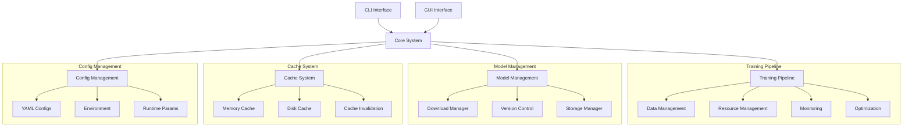
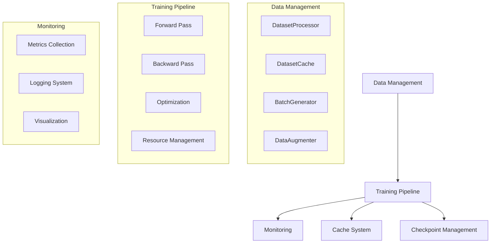
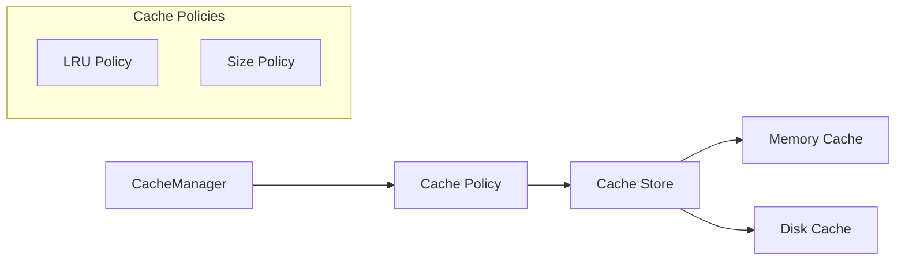
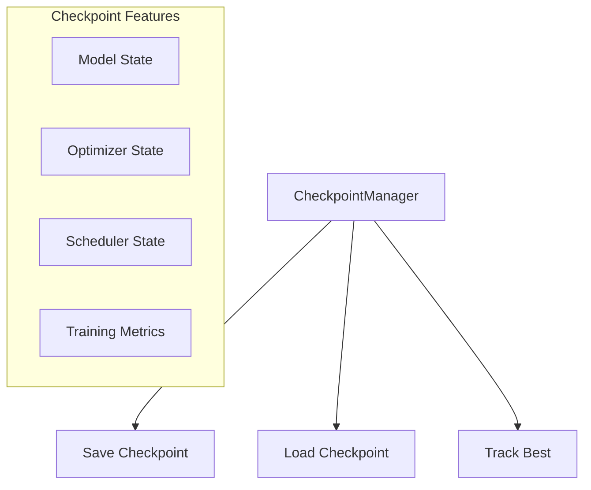

# LlamaHome Architecture

## Table of Contents

- [System Overview](#system-overview)
- [Core Components](#core-components)
- [Training Pipeline](#training-pipeline)
- [Model Management System](#model-management-system)
- [Cache System Architecture](#cache-system-architecture)
- [Resource Management](#resource-management)
- [System Integration](#system-integration)
- [Development Workflow](#development-workflow)
- [Security Architecture](#security-architecture)
- [Performance Optimization](#performance-optimization)
- [Directory Structure](#directory-structure)
- [Configuration Management](#configuration-management)
- [Testing Strategy](#testing-strategy)
- [Future Extensibility](#future-extensibility)

## Overview

LlamaHome is a comprehensive training and inference pipeline for LLM models with efficient resource management and monitoring. The system is designed with modularity and extensibility in mind, focusing on efficient training, smart caching, and robust monitoring.

## System Overview

LlamaHome is designed as a modular, extensible system for training and deploying large language models. The architecture follows clean code principles with clear separation of concerns, dependency injection, and comprehensive configuration management.



## Core Components

### 1. Training Pipeline

The training pipeline consists of the following key components:



### 2. Data Management

The data management system includes:

- **DatasetProcessor**: Handles data preprocessing and validation
- **DatasetCache**: Manages efficient data caching and retrieval
- **BatchGenerator**: Implements dynamic batch generation and padding
- **DataAugmenter**: Provides data augmentation capabilities

Directory Structure:
```text
src/
├── training/
│   ├── data.py          # Dataset processing
│   ├── cache.py         # Caching system
│   ├── batch.py         # Batch generation
│   ├── augmentation.py  # Data augmentation
│   └── pipeline.py      # Training pipeline
```

### 3. Cache System

The caching system implements:



Key features:
- Configurable cache policies
- Memory and disk backends
- Automatic cache invalidation
- Resource-aware caching

### 4. Checkpoint Management

The checkpoint system provides:



Features:
- Configurable save intervals
- Best checkpoint tracking
- Automatic cleanup
- Safe file operations

## Configuration Management

Configuration is handled through:

1. Environment variables (.env)
2. YAML/TOML configuration files
3. Command-line arguments

Example configuration structure:
```toml
[training]
batch_size = 32
learning_rate = 1e-4
gradient_accumulation_steps = 4

[cache]
memory_size = "4GB"
disk_size = "100GB"
policy = "lru"

[checkpoint]
save_steps = 1000
keep_last_n = 5
save_best = true
```

## Testing Strategy

The testing suite includes:

1. Unit Tests
   - Component-level testing
   - Mocked dependencies
   - Fast execution

2. Integration Tests
   - End-to-end workflows
   - Real data processing
   - Resource management

3. Performance Tests
   - Memory usage
   - Training speed
   - Cache efficiency

Directory Structure:
```text
tests/
├── unit/
│   ├── training/
│   ├── data/
│   └── cache/
├── integration/
└── performance/
```

## Security Considerations

1. Data Protection
   - Secure data handling
   - Token management
   - Access control

2. Resource Protection
   - Memory limits
   - Disk usage limits
   - Process isolation

## Future Extensibility

The system is designed for easy extension of:

1. Training Features
   - New optimizers
   - Custom schedulers
   - Advanced monitoring

2. Data Processing
   - Custom augmentations
   - New batch strategies
   - Additional cache backends

3. Model Support
   - New architectures
   - Custom attention mechanisms
   - Specialized optimizations
