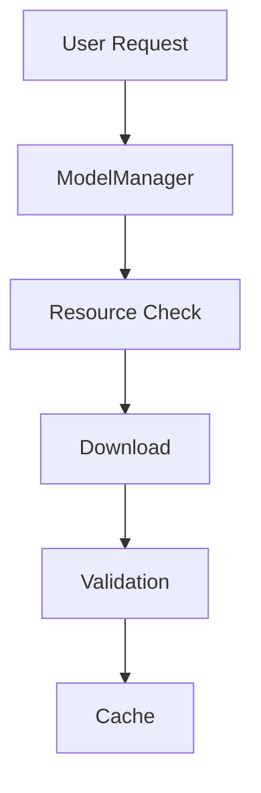
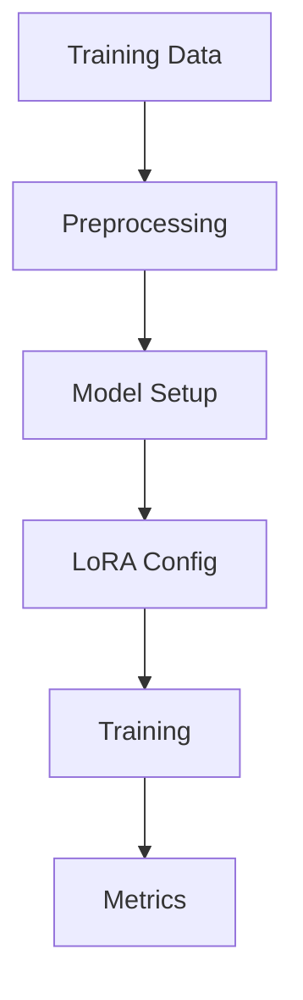

# LlamaHome Architecture

This document outlines the architectural design and implementation details of LlamaHome.

## System Overview

LlamaHome follows a modular, layered architecture with clear separation of concerns:

```text
LlamaHome/
├── src/
│   ├── core/           # Core system components
│   ├── interfaces/     # User interfaces (CLI, GUI)
│   └── data/          # Data management and training
├── utils/             # Utility modules
├── tests/             # Test suite
└── docs/              # Documentation
```

## Core Components

### 1. Model Management Layer

The model management layer handles model lifecycle and configuration:

```python
class ModelManager:
    """Manages model lifecycle."""
    def __init__(self):
        self.config = ModelConfig()
        self.models_dir = Path("data/models")
```

Key responsibilities:
- Model download and removal
- Version management
- Configuration handling
- Resource validation

### 2. Training Layer

The training system provides:
- Data preprocessing
- LoRA fine-tuning
- Progress tracking
- Metrics collection

Components:
```python
class TrainingManager:
    """Manages training operations."""
    def __init__(self):
        self.training_data = TrainingData()
        self.config = TrainingConfig()
```

### 3. Interface Layer

Multiple interface options:

1. CLI Interface:
   - Command-line interaction
   - Progress display
   - Rich formatting
   - History management

2. GUI Interface:
   - PyQt6-based interface
   - Real-time updates
   - Resource monitoring
   - Configuration management

### 4. Cache Management

Centralized caching system:

```text
.cache/
├── models/          # Model weights and parameters
├── training/        # Training artifacts
├── system/          # System-level cache
└── pycache/         # Python bytecode cache
```

Implementation:
```python
class CacheManager:
    """Manages system caches."""
    def __init__(self):
        self.config = CacheConfig()
        self._setup_directories()
        self._configure_pycache()
```

## Data Flow

### 1. Model Operations

Model download process:
1. Configuration validation
2. Resource check
3. Download initiation
4. Validation
5. Cache management



### 2. Training Pipeline

Training workflow:
1. Data preprocessing
2. Model preparation
3. LoRA configuration
4. Training execution
5. Metrics collection



## Configuration Management

### 1. Environment Configuration

Environment variables managed through `.env`:
```bash
LLAMAHOME_ENV=development
PYTHONPATH=./src:${PYTHONPATH}
LLAMAHOME_CACHE_SIZE=1024
```

### 2. Model Configuration

Model settings in `.config/models.json`:
```json
{
  "llama": {
    "formats": ["meta"],
    "versions": ["3.3-70b"],
    "default_version": "3.3-70b"
  }
}
```

### 3. Training Configuration

Training parameters in `.config/training_config.yaml`:
```yaml
training:
  batch_size: 4
  max_workers: 4
  lora:
    r: 8
    alpha: 32
```

## Resource Management

### 1. Memory Management

Memory optimization strategies:
- Lazy loading
- Memory mapping
- Gradient checkpointing
- Cache management

Implementation:
```python
class MemoryManager:
    """Manages memory resources."""
    def __init__(self):
        self.monitor = ResourceMonitor()
        self.cache = CacheManager()
```

### 2. GPU Management

GPU optimization:
- Multi-GPU support
- Mixed precision training
- Batch optimization
- Resource monitoring

## Error Handling

### 1. Exception Hierarchy

```python
class LlamaHomeError(Exception):
    """Base exception class."""
    pass

class ModelError(LlamaHomeError):
    """Model-related errors."""
    pass

class TrainingError(LlamaHomeError):
    """Training-related errors."""
    pass
```

### 2. Error Recovery

Recovery strategies:
1. Automatic retry
2. Graceful degradation
3. Resource cleanup
4. State restoration

## Testing Framework

### 1. Test Organization

```text
tests/
├── unit/
│   ├── test_model_manager.py
│   └── test_training.py
├── integration/
│   └── test_system.py
└── performance/
    └── test_benchmarks.py
```

### 2. Test Types

1. Unit Tests:
   - Component isolation
   - Mock dependencies
   - Edge cases
   - Error conditions

2. Integration Tests:
   - Component interaction
   - End-to-end workflows
   - Resource management
   - Error handling

3. Performance Tests:
   - Benchmarking
   - Resource usage
   - Scalability
   - Optimization

## Logging and Monitoring

### 1. Log Management

Centralized logging:
```python
class LogManager:
    """Manages system logging."""
    def __init__(self):
        self.config = LogConfig()
        self._setup_handlers()
```

Log organization:
```text
.logs/
├── app/
│   ├── error.log
│   └── access.log
├── models/
│   └── training.log
└── system/
    └── performance.log
```

### 2. Metrics Collection

Performance metrics:
- Training progress
- Resource usage
- Cache efficiency
- System health

## Security Considerations

### 1. API Security

- Token management
- Request validation
- Rate limiting
- Error masking

### 2. Data Security

- Model file integrity
- Training data protection
- Cache security
- Configuration safety

## Deployment

### 1. Environment Setup

```makefile
setup:
    poetry install
    python setup.py
```

### 2. Configuration

```bash
# Development
make setup ENV=development

# Production
make setup ENV=production
```

### 3. Verification

```bash
# System check
make check

# Tests
make test
```

## Performance Optimization

### 1. Caching Strategy

- Model caching
- Training cache
- System cache
- Bytecode cache

### 2. Resource Optimization

- Memory management
- GPU utilization
- Disk usage
- Network efficiency

## Future Considerations

### 1. Scalability

Planned improvements:
- Distributed training
- Model parallelism
- Dynamic resource allocation
- Cloud integration

### 2. Extensibility

Extension points:
- Model adapters
- Training plugins
- Interface modules
- Metric collectors

## Best Practices

### 1. Development

- Code formatting
- Documentation
- Testing
- Error handling

### 2. Deployment

- Environment setup
- Configuration
- Monitoring
- Maintenance

### 3. Performance

- Resource management
- Optimization
- Monitoring
- Tuning
