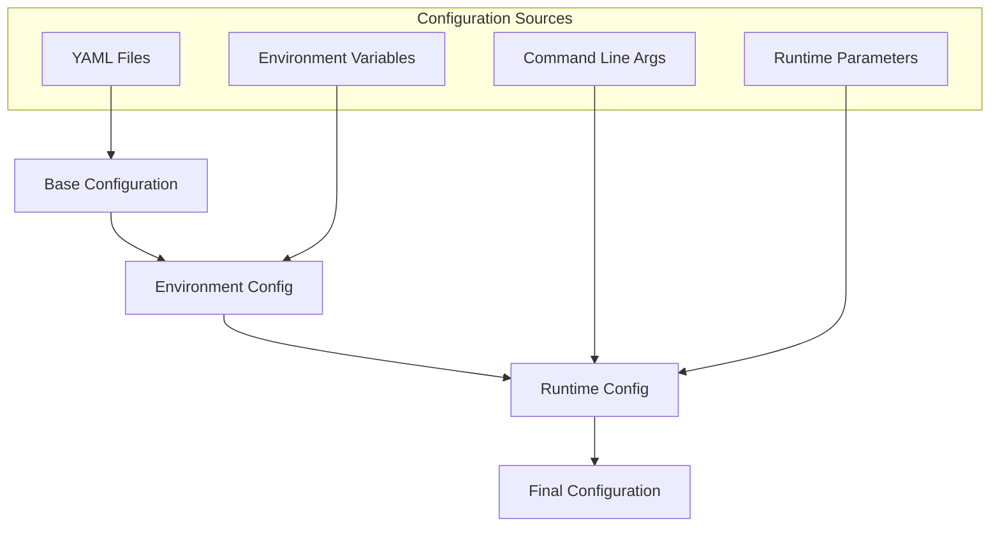

# LlamaHome Architecture

## System Overview

LlamaHome is designed as a modular, extensible system for training and deploying large language models. The architecture follows clean code principles with clear separation of concerns, dependency injection, and comprehensive configuration management.


## Core Components

### 1. Training Pipeline

The training pipeline orchestrates the entire training process through interconnected components:


Directory Structure:

```text
src/
├── training/
│   ├── pipeline.py       # Main training orchestration
│   ├── data/            # Data processing and loading
│   │   ├── loader.py    # Data loading utilities
│   │   ├── transform.py # Data transformations
│   │   └── validate.py  # Data validation
│   ├── optimization/    # Training optimization
│   │   ├── scheduler.py # Learning rate scheduling
│   │   ├── gradient.py  # Gradient handling
│   │   └── memory.py    # Memory optimization
│   ├── monitoring/      # Training monitoring
│   │   ├── metrics.py   # Metric collection
│   │   ├── logging.py   # Logging system
│   │   └── viz.py       # Visualization
│   └── cache/          # Caching system
       ├── strategy.py   # Cache strategies
       ├── policy.py     # Cache policies
       └── store.py      # Cache storage
```

#### Configuration System



Configuration Hierarchy:

- Base configurations in `.config/`
- Environment-specific overrides
- Runtime parameters
- Command-line arguments

### 2. Model Management System


### 3. Cache System Architecture


### 4. Resource Management


## System Integration


## Development Workflow


## Security Architecture


## Performance Optimization


## Directory Structure

Complete system layout:

```text
.
├── src/                 # Source code
│   ├── core/           # Core system components
│   ├── training/       # Training system
│   ├── interfaces/     # User interfaces
│   └── utils/          # Utilities
├── tests/              # Test suite
│   ├── unit/          # Unit tests
│   ├── integration/   # Integration tests
│   └── performance/   # Performance tests
├── .config/            # Configuration files
├── .cache/             # Cache directory
│   ├── models/        # Model cache
│   ├── training/      # Training cache
│   └── system/        # System cache
├── data/               # Data directory
│   ├── training/      # Training data
│   ├── models/        # Model files
│   └── metrics/       # Training metrics
└── docs/               # Documentation
```

## Configuration Management

Detailed configuration hierarchy:


Key configuration files:

- `training_config.yaml`: Training parameters
- `models.json`: Model configurations
- `.env`: Environment variables

## Testing Strategy

Comprehensive testing approach:


## Future Extensibility

The architecture is designed for easy extension through:


- Modular components
- Clear interfaces
- Configuration-driven behavior
- Plugin system support
