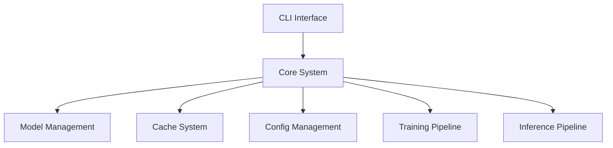

# LlamaHome Command-Line Interface (CLI)

## Table of Contents

- [Overview](#overview)
- [Key Features](#key-features)
- [Getting Started](#getting-started)
- [CLI Features](#cli-features)
- [Advanced Usage](#advanced-usage)
- [Configuration & Integration](#configuration-and-integration)
- [Troubleshooting](#troubleshooting)
- [Best Practices](#best-practices)
- [Next Steps](#next-steps)

## Overview

This document provides a comprehensive overview of LlamaHome's command-line interface (CLI), including key features, getting started, CLI features, advanced usage, configuration & integration, troubleshooting, best practices, and next steps.



### Key Features

- Shell-like Interface: Familiar navigation, history search, and tab completion
- Persistent History: Your command history persists across sessions, making repeated tasks more efficient
- Dynamic Suggestions: Real-time auto-completion and suggestions based on installed models and past inputs
- Asynchronous Requests: Manage time-consuming operations without blocking the interface
- Configurable Outputs: Switch between plain text, JSON, or rich formatting as needed
- Progress Indicators: Visual cues for model downloads, training operations, and long-running tasks
- Integration Hooks: Seamlessly integrate with model configurations, caching, and plugin systems

## Getting Started

### Prerequisites

- Python: Version 3.11 or higher required
- Dependency Management: Poetry for easy setup
- Model Files: Ensure you have at least one supported Llama model available, or be prepared to download one

### Installation Steps

1. Install Poetry (if not already installed):

   ```bash
   curl -sSL https://install.python-poetry.org | python3 -
   ```

2. Clone and Install LlamaHome:

   ```bash
   git clone https://github.com/llamahome/llamahome.git
   cd llamahome

   poetry install  # Install dependencies
   poetry shell    # Activate virtual environment
   ```

3. Set Up Environment Variables:

   ```bash
   # UNIX-like systems
   export LLAMA_HOME_MODEL_PATH=/path/to/llama/model

   # Windows (PowerShell)
   $Env:LLAMA_HOME_MODEL_PATH="C:\path\to\llama\model"
   ```

Adjust these paths and environment variables according to your setup.

### Launching the CLI

Once the environment is prepared, launch the CLI with:

```bash
llamahome
```

If you've installed using Poetry, you may need:

```bash
poetry run llamahome
```

## CLI Features

### Command History & Navigation

- History Recall: Use Up/Down arrows to navigate through previously executed commands
- Search History: Press Ctrl+R to search through your command history
- Persisted History: By default, history is saved in `.config/history.txt`, so it's available after restarts

### Auto-Completion & Suggestions

- Tab Completion: Press Tab to auto-complete commands, model names, and file paths
- Dynamic Suggestions: As you type, suggestions appear in gray. Press Right Arrow to accept them
- Multiple Options: If multiple completions are available, a menu appears. Use arrow keys to navigate and Enter to select

### Key Bindings

- Ctrl+C: Cancel the current operation (if any)
- Ctrl+D: Exit the CLI
- Arrow Keys: Move the cursor left/right through the current line or up/down through history
- Home/End: Jump to the start or end of the line
- Ctrl+K/U/W/Y: Edit text inline (cut/paste words or entire lines)

### Mouse Support

- Click to Position Cursor: Jump to any point in the command line
- Click to Select Completion Options: Quickly choose suggestions with a mouse click
- Scroll Completion Menu: If the completion list is long, scroll to find the right option

### Basic Commands

- `help`: Show a list of available commands and usage examples
- `models`: List all available models, including versions and compatibility info
- `model <name>`: Select a model for subsequent operations
- `download <model>`: Download specified model resources
- `remove <model>`: Remove a previously downloaded model
- `chat`: Start an interactive chat session with the selected model
- `train <params>`: Train a model with specified parameters (data paths, epochs, etc.)
- `quit`: Exit the CLI

Example:

```bash
llamahome> models
Available Models:
 - llama-3.3-7b (version 3.3-7b)

llamahome> model llama-3.3-7b
[INFO] Model set to llama-3.3-7b

llamahome> download llama-3.3-7b --force
[INFO] Downloading model...
[INFO] Download complete.
```

## Advanced Usage

### Multi-Format Output

- Text Output (default): Ideal for direct reading in the terminal
- JSON Output: Use `--output json` for structured output, perfect for scripting or integration with other tools
- Progress Indicators: Long-running tasks (like training) show progress bars and estimated completion times

### Environment Customization

Set environment variables for customization:

```bash
export LLAMAHOME_CONFIG=./config/custom_config.toml
export LLAMAHOME_CACHE=./.cache/models
```

These variables influence the default paths, caching strategies, and model directories used by the CLI.

### Scripting & Automation

Combine CLI commands in shell scripts to automate tasks. For example:

```bash
#!/usr/bin/env bash

# Batch download models
llamahome download llama-3.3-7b
llamahome download llama-3.3-7b-finetuned

# List models to verify
llamahome models
```

Run `chmod +x script.sh` and `./script.sh` to execute.

## Configuration & Integration

### Model Configuration Files

Models are defined in `.config/models.json`:

```json
{
  "llama": {
    "versions": {
      "3.3-7b": {
        "url": "https://example.com/llama-3.3-7b",
        "size": "7B",
        "type": "base",
        "format": "meta"
      }
    }
  }
}
```

When you run `llamahome download llama-3.3-7b`, the CLI reads these definitions to know where to fetch models.

### Plugin Support

Extend CLI functionality with plugins that add new commands or integrations:

- Install Plugins: Place them in the `plugins/` directory
- Configure in `.config/plugins.toml`: Enable or disable plugins
- New Commands: Loaded automatically at CLI startup

## Troubleshooting

### Common Issues

1. Command Not Found
   - Check that the CLI is installed properly
   - Confirm your PATH includes Poetry's bin directory if using Poetry

2. Slow Completion or Response
   - Check for model availability in `.config/models.json`
   - Verify that the model is downloaded and properly configured
   - Consider enabling hardware acceleration or streaming in config files

3. Network or Download Issues
   - Ensure internet connectivity
   - Verify the model URL and credentials if required
   - Try using `--force` to redownload corrupted files

4. Compatibility Problems
   - Ensure Python 3.11 or higher is installed
   - Check CUDA version and GPU drivers if using GPU acceleration
   - Update dependencies with `poetry update`

### Logs & Diagnostics

- Check logs in `logs/` directory for detailed error reports
- Increase verbosity using `--verbose` for more detailed output
- Consult the LlamaHome Community Forum for additional support and best practices

## Best Practices

- Keep Your CLI Updated: Regularly pull the latest changes from the repository and run `poetry install` to get bug fixes and new features
- Backup Configuration: Keep a backup of `.config/models.json` and `.config/history.txt`
- Use Versioned Models: Specify exact model versions to ensure reproducibility
- Prompt Clarity: Provide clear and explicit prompts for better model responses

## Next Steps

- [GUI Guide](GUI.md): For a graphical interface to LlamaHome features
- [API Documentation](API.md): Integrate programmatically with LlamaHome
- [Plugin Development](Plugins.md): Extend the CLI with custom plugins
- [Advanced Configuration](Config.md): Dive deeper into YAML and JSON configurations
