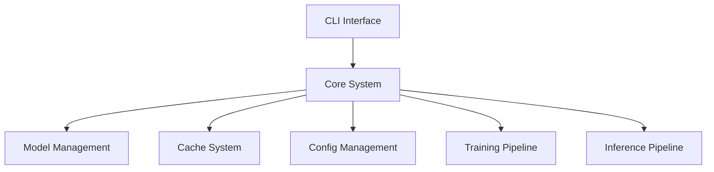

# LlamaHome Command-Line Interface (CLI)

## Table of Contents

- [Overview](#overview)
- [Key Features](#key-features)
- [Getting Started](#getting-started)
- [CLI Features](#cli-features)
- [Advanced Usage](#advanced-usage)
- [Configuration & Integration](#configuration-and-integration)
- [Troubleshooting](#troubleshooting)
- [Best Practices](#best-practices)
- [Next Steps](#next-steps)

## Overview

This document provides a comprehensive overview of LlamaHome's command-line interface (CLI), including key features, getting started, CLI features, advanced usage, configuration & integration, troubleshooting, best practices, and next steps.



### Key Features

- Shell-like Interface: Familiar navigation, history search, and tab completion
- Persistent History: Your command history persists across sessions, making repeated tasks more efficient
- Dynamic Suggestions: Real-time auto-completion and suggestions based on installed models and past inputs
- Asynchronous Requests: Manage time-consuming operations without blocking the interface
- Configurable Outputs: Switch between plain text, JSON, or rich formatting as needed
- Progress Indicators: Visual cues for model downloads, training operations, and long-running tasks
- Integration Hooks: Seamlessly integrate with model configurations, caching, and plugin systems

## Getting Started

### Prerequisites

- Python 3.11 or higher
- Virtual environment (recommended)
- CUDA-capable GPU (optional)

### Installation

1. Clone and Install:

   ```bash
   git clone https://github.com/zachshallbetter/llamahome.git
   cd llamahome
   make setup
   ```

2. Set Up Environment:

   ```bash
   # Copy example environment file
   cp .env.example .env

   # Edit environment variables
   nano .env
   ```

3. Verify Installation:

   ```bash
   # Activate virtual environment
   source .venv/bin/activate  # Unix/macOS
   # or
   .venv\Scripts\activate     # Windows

   # Run CLI
   python -m src.interfaces.cli
   ```

## CLI Features

### Command History & Navigation

- History Recall: Up/Down arrows
- Search History: Ctrl+R
- History saved in `.config/history.txt`

### Auto-Completion & Suggestions

- Tab Completion: Commands, models, paths
- Dynamic Suggestions: Gray text, Right Arrow to accept
- Multiple Options: Arrow keys to navigate

### Key Bindings

- Ctrl+C: Cancel operation
- Ctrl+D: Exit CLI
- Arrow Keys: Navigation
- Home/End: Line navigation
- Ctrl+K/U/W/Y: Text editing

### Basic Commands

```bash
# Show help
help

# List models
models

# Download model
download llama-3.3-7b

# Start chat
chat

# Exit CLI
quit
```

## Configuration

### Environment Variables

```bash
# Core settings
LLAMAHOME_ENV=development
LLAMAHOME_LOG_LEVEL=INFO

# Model settings
LLAMA_MODEL=llama3.3
LLAMA_MODEL_SIZE=13b
```

### Project Configuration

Configuration is managed through `pyproject.toml`:

```toml
[project]
name = "llamahome"
version = "0.1.0"
requires-python = ">=3.11"

[project.scripts]
llamahome = "src.interfaces.cli:main"

[tool.llamahome.cli]
history_file = ".config/history.txt"
max_history = 1000
completion_style = "fancy"
```

## Advanced Usage

### Multi-Format Output

```bash
# JSON output
llamahome --output json list-models

# Detailed output
llamahome --verbose train
```

### Scripting & Automation

```bash
#!/usr/bin/env bash

# Activate environment
source .venv/bin/activate

# Run commands
llamahome download llama-3.3-7b
llamahome train --data path/to/data
```

## Troubleshooting

### Common Issues

1. Command Not Found
   ```bash
   # Ensure virtual environment is activated
   source .venv/bin/activate
   ```

2. Model Issues
   ```bash
   # Verify model installation
   llamahome verify-model llama-3.3-7b
   ```

3. Environment Issues
   ```bash
   # Check configuration
   llamahome doctor
   ```

### Debug Mode

```bash
# Enable debug logging
export LLAMAHOME_LOG_LEVEL=DEBUG

# Run with debug output
llamahome --debug
```

## Best Practices

1. Environment Management
   - Use virtual environment
   - Keep dependencies updated
   - Follow configuration structure

2. Command Usage
   - Use tab completion
   - Leverage history search
   - Check command help

3. Resource Management
   - Monitor system resources
   - Clean up unused models
   - Manage cache effectively

## Next Steps

1. [Training Guide](Training.md)
2. [Model Management](Models.md)
3. [API Integration](API.md)
4. [Performance Tuning](Performance.md)
