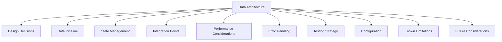

# Data Architecture

## Table of Contents

- [Design Decisions](#design-decisions)
- [Data Pipeline](#data-pipeline)
- [State Management](#state-management)
- [Integration Points](#integration-points)
- [Performance Considerations](#performance-considerations)
- [Error Handling](#error-handling)
- [Testing Strategy](#testing-strategy)
- [Configuration](#configuration)
- [Known Limitations](#known-limitations)
- [Future Considerations](#future-considerations)

## Overview

This document provides a comprehensive overview of LlamaHome's data architecture, including design decisions, data pipeline, state management, integration points, performance considerations, error handling, testing strategy, configuration, known limitations, and future considerations.



## Data Architecture Overview

LlamaHome's data architecture is designed to be modular, scalable, and efficient. It uses a streaming approach with async processing to handle large datasets and complex training tasks. The architecture is designed to be flexible and extensible, allowing for easy customization and integration with other systems.

## Design Decisions

### Data Pipeline

The training pipeline uses a streaming approach with async processing:

```python
class TrainingPipeline:
    """
    Streaming pipeline with:
    1. Async data loading
    2. Prefetch queue
    3. Dynamic batching
    4. Resource monitoring
    """
```

Key considerations:

- Memory efficiency prioritized over raw processing speed
  - Streaming data loading with configurable batch sizes
  - Automatic garbage collection of processed batches
  - Memory-mapped files for large datasets

- Optimized disk I/O operations
  - Asynchronous prefetching and buffering
  - Compressed data formats (e.g. Arrow, Parquet)
  - Sequential read patterns where possible

- Intelligent resource scheduling
  - Dynamic load balancing across GPUs
  - CPU/GPU memory monitoring
  - Automatic batch size adjustment

- Parallel processing capabilities
  - Multi-GPU training support
  - Distributed data loading
  - Pipeline parallelism

- Model-aware data handling
  - Format-specific tokenization
  - Adaptive sequence length
  - Model-specific data augmentation

- Robust validation pipeline
  - Schema validation
  - Data type checking
  - Missing value handling
  - Outlier detection

- Smart caching system
  - LRU cache for frequent data
  - Disk-backed caching for large datasets
  - Cache invalidation policies

- Flexible data distribution
  - Dynamic sharding
  - Load-balanced partitioning
  - Cross-validation splits

- Comprehensive versioning
  - Dataset versioning
  - Preprocessing step tracking
  - Training run history

- Data quality assurance
  - Automated quality checks
  - Data drift detection
  - Consistency validation

- Enterprise-grade security
  - Data encryption at rest
  - Access control and auditing
  - Secure data deletion

### State Management

Training state persistence uses a tiered approach:

```python
class TrainingState:
    """
    Tiered state management:
    1. In-memory cache (active)
    2. Disk cache (recent)
    3. Archive (historical)
    
    State transitions based on:
    - Memory pressure
    - Access patterns
    - Training phase
    """
```

### Integration Points

Core hooks for pipeline customization:

1. Data Loading:
   - Custom dataset formats
   - Preprocessing plugins
   - Validation rules

2. Training Loop:
   - Custom callbacks
   - Metric collection
   - Resource monitoring

3. State Management:
   - Checkpoint strategies
   - Recovery handlers
   - Cache policies

## Performance Considerations

### Memory Management

Training uses a hybrid memory strategy:

1. Active Memory:
   - Current batch
   - Model states
   - Gradients

2. Cache Memory:
   - Recent batches
   - Validation data
   - Metrics

3. Disk Storage:
   - Historical data
   - Checkpoints
   - Archived metrics

### Resource Optimization

Automatic resource balancing:

```python
class ResourceManager:
    """
    Balances:
    1. GPU memory
    2. CPU utilization
    3. Disk I/O
    4. Network bandwidth
    
    Adjusts:
    - Batch size
    - Prefetch depth
    - Cache policy
    """
```

## Error Handling

Critical paths use specialized exceptions:

```python
class TrainingError(Exception):
    """Base class for training errors."""
    pass

class DataError(TrainingError):
    """Data pipeline errors."""
    pass

class StateError(TrainingError):
    """State management errors."""
    pass
```

## Testing Strategy

Key test areas:

1. Data Pipeline:

   ```python
   @pytest.mark.asyncio
   async def test_streaming():
       """Verify streaming performance."""
   ```

2. State Management:

   ```python
   def test_checkpoint_recovery():
       """Verify state recovery."""
   ```

3. Resource Usage:

   ```python
   @pytest.mark.gpu
   def test_memory_optimization():
       """Verify memory efficiency."""
   ```

## Configuration

Training configuration focuses on critical parameters:

```yaml
training:
  pipeline:
    batch_size: "auto"  # Dynamic based on resources
    prefetch: 2         # Number of batches to prefetch
    max_memory: 0.8     # Maximum memory utilization

  optimization:
    mixed_precision: true
    gradient_checkpointing: true
    compile_mode: "reduce-overhead"

  resources:
    gpu_memory_fraction: 0.9
    cpu_workers: "auto"
    io_queue_size: 1000
```

## Known Limitations

1. Resource Constraints:
   - Memory scales with batch size
   - I/O bottlenecks with large datasets
   - GPU memory fragmentation

2. Performance Tradeoffs:
   - Streaming vs. caching
   - Precision vs. memory
   - Checkpoint frequency

## Future Considerations

1. Optimizations:
   - Improved memory mapping
   - Better I/O scheduling
   - Enhanced state persistence

2. Integration Points:
   - Custom data formats
   - Pipeline plugins
   - Monitoring hooks
