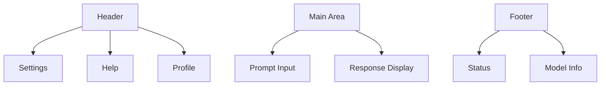

# LlamaHome Graphical User Interface (GUI)

This document outlines how to use the LlamaHome GUI to interact with the Llama 3.3 model.
The GUI provides a modern, accessible interface for both casual users and power users.

## Overview

Key Features:

- Intuitive prompt input and response display
- Real-time model parameter adjustment
- Batch processing capabilities
- Theme customization
- Accessibility features

## Interface Layout



### Components

```text
+----------------------------------+
|           LlamaHome GUI          |
+----------------------------------+
|  [Settings] [Help] [Profile]     |
+----------------------------------+
|                                  |
|     Prompt Input Area            |
|     [Submit] [Clear] [History]   |
|                                  |
+----------------------------------+
|                                  |
|     Response Display             |
|     [Copy] [Export] [Share]      |
|                                  |
+----------------------------------+
|  Status: Ready | Model: Loaded   |
+----------------------------------+
```

## Quick Start

### Installation

1. Install dependencies:

   ```bash
   pip install -r requirements.txt
   ```

2. Launch the application:

   ```bash
   python llama_home_gui.py
   ```

### Initial Setup

1. Configure Model:
   - Click Settings (⚙️)
   - Set Model Path
   - Click Apply

2. Start Using:
   - Type prompt in input area
   - Click Submit or press Enter
   - View response in display area

## Features

### Prompt Input

- Multi-line text input
- Template selection
- History browsing (↑/↓)
- Auto-completion
- Syntax highlighting

### Response Display

- Syntax highlighting
- Code block formatting
- Image generation preview
- Export options (JSON, TXT, MD)
- Search functionality

### Settings Panel

- Model configuration
- Theme selection
- Font customization
- Keyboard shortcuts
- Performance tuning

### Batch Processing

- Drag-and-drop file upload
- Progress tracking
- Result aggregation
- Export formats
- Error handling

## Accessibility

### Keyboard Navigation

| Action | Shortcut | Description |
|--------|----------|-------------|
| Submit | Ctrl+Enter | Submit current prompt |
| Settings | Ctrl+, | Open settings panel |
| New Session | Ctrl+N | Start new session |
| Save | Ctrl+S | Save current session |
| Copy | Ctrl+C | Copy selected text |
| Help | F1 | Open help panel |

### Screen Reader Support

- ARIA labels
- Role annotations
- Focus management
- Status announcements
- Error notifications

### Visual Adjustments

- High contrast themes
- Font scaling
- Color blindness modes
- Motion reduction
- Custom styling

## Customization

### Themes

```yaml
theme:
  name: "Dark Modern"
  colors:
    background: "#1E1E1E"
    foreground: "#D4D4D4"
    accent: "#007ACC"
  fonts:
    main: "Segoe UI"
    code: "Cascadia Code"
  spacing:
    unit: 8
```

### Keyboard Shortcuts

```yaml
shortcuts:
  submit:
    key: "Enter"
    modifiers: ["Ctrl"]
  newSession:
    key: "N"
    modifiers: ["Ctrl"]
```

## Performance

### Memory Optimization

- Progressive loading
- Response streaming
- Limited history size
- Resource cleanup
- Cache management

### Display Performance

- Hardware acceleration
- Minimal animations
- Optimized rendering
- Efficient reflows
- Background processing

## Troubleshooting

### Common Issues

1. Display Problems

   ```text
   Symptom: Blurry text or scaling issues
   Solution: 
   - Check DPI settings
   - Update graphics drivers
   - Adjust scaling in Settings
   ```

2. Performance Issues

   ```text
   Symptom: Slow response or lag
   Solution:
   - Enable hardware acceleration
   - Reduce animation effects
   - Clear application cache
   ```

3. Connection Errors

   ```text
   Symptom: Cannot connect to model
   Solution:
   - Verify model path
   - Check network settings
   - Restart application
   ```

## Advanced Usage

### Custom Plugins

```python
@plugin
class CustomView:
    """Custom visualization plugin."""
    def render(self, data):
        """Render custom view."""
        pass
```

### API Integration

```python
from llamahome.gui import GUI

gui = GUI()
gui.start_server(port=8080)
```

### Event Handling

```python
@gui.on('response')
def handle_response(data):
    """Custom response handler."""
    process_response(data)
```

## Security

### Data Protection

- Secure storage of settings
- Encrypted communication
- Session management
- Input validation
- Output sanitization

### Access Control

- User authentication
- Role-based permissions
- Session timeouts
- Audit logging
- Security headers

## Support

For assistance:

- Documentation: [LlamaHome Wiki](https://wiki.llamahome.ai)
- Support Team: <support@llamahome.ai>
- GitHub Issues: [Report Bug](https://github.com/llamahome/issues)

> Note: Replace placeholder URLs with actual values for your deployment.
