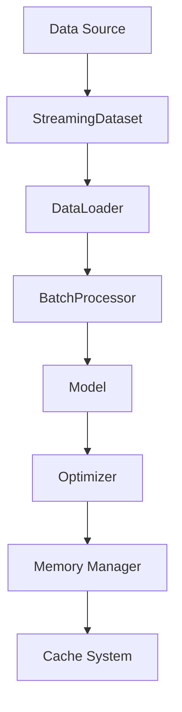

# Training System

## Overview

LlamaHome's training system is designed for efficient fine-tuning of large language models using state-of-the-art techniques. The system supports various training approaches including LoRA (Low-Rank Adaptation) and full fine-tuning.

## Quick Start

```bash
# Start training with default configuration
make train DATA_PATH=data/training/dataset.jsonl

# Resume from checkpoint
make train-resume CHECKPOINT=output/training/checkpoint-1000

# Evaluate model
make train-eval MODEL=output/training/final DATA=data/eval/test.jsonl
```

## Configuration

Training configuration is managed through `.config/training_config.yaml`:

```yaml
# Key configuration sections
cache:          # Cache settings
data:           # Data processing
monitor:        # Progress tracking
optimization:   # Training parameters
processing:     # Compute options
resource:       # Resource management
training:       # Core training settings
```

## Directory Structure

```text
data/
├── training/           # Training datasets
│   ├── raw/           # Original data
│   └── processed/     # Preprocessed data
├── models/            # Model files
│   ├── base/          # Base models
│   └── fine-tuned/    # Fine-tuned models
└── metrics/           # Training metrics
    ├── logs/          # Training logs
    └── tensorboard/   # TensorBoard data
```

## Training Pipeline

### 1. Data Preparation

The system supports multiple data formats

- JSON/JSONL
- CSV/TSV
- Text files
- Custom formats via plugins

Data processing includes

- Tokenization
- Sequence padding
- Batching
- Validation splitting

### 2. Model Preparation

Model initialization includes

- Loading base model
- Applying LoRA configuration
- Setting up optimizer
- Configuring learning rate scheduler

### 3. Training Process

The training loop handles

- Batch processing
- Gradient computation
- Parameter updates
- Checkpoint saving
- Progress monitoring

### 4. Monitoring

Real-time monitoring of

- Loss metrics
- Learning rate
- GPU utilization
- Memory usage
- Training speed

## Advanced Features

### 1. Resource Optimization

- Gradient checkpointing
- Mixed precision training
- Dynamic batch sizing
- Memory-efficient attention

### 2. Training Techniques

- LoRA fine-tuning
- Full model fine-tuning
- Quantization-aware training
- Distributed training support

### 3. Customization

Extensible components:

- Custom datasets
- Training callbacks
- Metrics collection
- Loss functions

## CLI Commands

```bash
# Basic training
llamahome train <data_path> [options]

# Training options
--model MODEL         # Base model to use
--output OUTPUT       # Output directory
--config CONFIG       # Custom config file
--eval-data EVAL     # Evaluation dataset

# Resume training
llamahome train-resume <checkpoint> [options]

# Evaluation
llamahome train-eval <model> <data> [options]
```

## Configuration Details

### Cache Configuration

```yaml
cache:
  memory_size: 1000        # Memory cache size (MB)
  disk_size: 10000        # Disk cache size (MB)
  cleanup_interval: 3600   # Cleanup interval (seconds)
  max_age_days: 7         # Maximum cache age
```

### Data Configuration

```yaml
data:
  batch_size: 4           # Training batch size
  max_length: 512         # Maximum sequence length
  num_workers: 4          # Data loading workers
  validation_split: 0.1   # Validation set size
```

### Optimization Configuration

```yaml
optimization:
  learning_rate: 5.0e-5   # Initial learning rate
  weight_decay: 0.01      # Weight decay
  warmup_steps: 100       # Warmup steps
  scheduler_type: cosine  # LR scheduler type
```

### Processing Configuration

```yaml
processing:
  mixed_precision: true   # Use mixed precision
  gradient_checkpointing: true  # Use gradient checkpointing
  compile_mode: reduce-overhead # Compilation mode
```

## Best Practices

### 1. Data Preparation

- Clean and validate data
- Use appropriate batch sizes
- Balance dataset if needed
- Implement data augmentation

### 2. Training Setup

- Start with small experiments
- Monitor resource usage
- Use appropriate learning rates
- Save checkpoints regularly

### 3. Optimization

- Enable mixed precision
- Use gradient checkpointing
- Optimize batch size
- Monitor memory usage

### 4. Evaluation

- Use separate test set
- Track multiple metrics
- Validate regularly
- Save evaluation results

## Troubleshooting

Common issues and solutions:

1. Out of Memory
   - Reduce batch size
   - Enable gradient checkpointing
   - Use mixed precision
   - Reduce model size

2. Slow Training
   - Check data loading
   - Optimize batch size
   - Monitor GPU utilization
   - Check disk I/O

3. Poor Convergence
   - Adjust learning rate
   - Check data quality
   - Monitor loss curves
   - Validate batch size

## Performance Tips

1. Data Loading
   - Use appropriate num_workers
   - Enable data caching
   - Use memory mapping
   - Optimize batch size

2. Model Training
   - Use mixed precision
   - Enable gradient checkpointing
   - Optimize memory usage
   - Monitor GPU utilization

3. Resource Usage
   - Monitor memory usage
   - Track GPU utilization
   - Check disk I/O
   - Monitor network usage

## Memory-Efficient Training

### Architecture Overview



### Implementation Components

1. **Streaming Dataset**

   ```python
   class StreamingDataset:
       """Memory-efficient dataset implementation."""
       
       def __init__(
           self,
           data_path: Path,
           buffer_size: int = 1000,
           memory_limit: Optional[int] = None
       ):
           self.buffer_size = buffer_size
           self.memory_limit = memory_limit
   ```

   Key features:
   - Dynamic buffer management
   - Memory monitoring
   - Efficient I/O
   - Automatic cleanup

2. **Batch Processing**

   ```python
   class BatchProcessor:
       """Optimized batch processing."""
       
       def process_batch(
           self,
           batch: Dict[str, torch.Tensor]
       ) -> Dict[str, torch.Tensor]:
           if self.config.dynamic_batch_size:
               batch = self._adjust_batch_size(batch)
           return self._process_optimized(batch)
   ```

   Features:
   - Dynamic batch sizing
   - Memory tracking
   - Gradient accumulation
   - Resource optimization

## Training Pipeline

### Configuration

```yaml
training:
  # Memory settings
  memory_limit: "90%"
  batch_size: "auto"
  gradient_accumulation: 4
  
  # Optimization
  mixed_precision: true
  gradient_checkpointing: true
  memory_efficient_attention: true
  
  # Resources
  num_workers: "auto"
  prefetch_factor: 2
  pin_memory: true
```

### Pipeline Components

1. **Data Management**

   ```python
   class DataManager:
       """Memory-efficient data management."""
       
       async def load_data(
           self,
           path: Path
       ) -> DataLoader:
           dataset = StreamingDataset(
               path,
               buffer_size=self.config.buffer_size,
               memory_limit=self.config.memory_limit
           )
           return self._create_optimized_loader(dataset)
   ```

2. **Training Loop**

   ```python
   class TrainingLoop:
       """Optimized training implementation."""
       
       async def train_epoch(
           self,
           dataloader: DataLoader
       ) -> Dict[str, float]:
           metrics = defaultdict(float)
           for batch in dataloader:
               batch_metrics = await self._process_batch(batch)
               self._update_metrics(metrics, batch_metrics)
           return metrics
   ```

## Memory Management

### Resource Tracking

1. **Memory Monitor**

   ```python
   class MemoryMonitor:
       """Track memory usage during training."""
       
       def update(self):
           stats = {
               "gpu": self._get_gpu_stats(),
               "cpu": self._get_cpu_stats(),
               "cache": self._get_cache_stats()
           }
           self._log_stats(stats)
   ```

2. **Resource Manager**

   ```python
   class ResourceManager:
       """Manage training resources."""
       
       def optimize_resources(self):
           self._optimize_memory()
           self._optimize_compute()
           self._optimize_cache()
   ```

### Optimization Strategies

1. **Memory Optimization**

   ```python
   class MemoryOptimizer:
       """Optimize memory usage."""
       
       def optimize(self):
           if torch.cuda.is_available():
               self._optimize_gpu_memory()
           self._optimize_cpu_memory()
           self._optimize_cache_memory()
   ```

2. **Training Optimization**

   ```python
   class TrainingOptimizer:
       """Optimize training process."""
       
       def optimize(self):
           self._enable_mixed_precision()
           self._enable_gradient_checkpointing()
           self._optimize_attention()
   ```

## Performance Monitoring

### Metrics Collection

1. **Training Metrics**

   ```python
   class MetricsCollector:
       """Collect training metrics."""
       
       def collect(self):
           return {
               "loss": self._get_loss(),
               "memory": self._get_memory_usage(),
               "throughput": self._get_throughput()
           }
   ```

2. **Performance Tracking**

   ```python
   class PerformanceTracker:
       """Track training performance."""
       
       def track(self):
           metrics = self.metrics_collector.collect()
           self.optimizer.adjust(metrics)
           self.logger.log_metrics(metrics)
   ```

## Error Handling

### Memory Management

1. **OOM Handler**

   ```python
   class OOMHandler:
       """Handle out-of-memory errors."""
       
       def handle_oom(self, error: RuntimeError):
           self._reduce_batch_size()
           self._clear_cache()
           self._log_error(error)
   ```

2. **Resource Recovery**

   ```python
   class ResourceRecovery:
       """Recover from resource issues."""
       
       def recover(self):
           self._cleanup_memory()
           self._reset_state()
           self._restore_checkpoints()
   ```

## Best Practices

### Memory Efficiency

1. **Data Loading**
   - Use streaming datasets
   - Enable memory limits
   - Implement proper cleanup
   - Monitor resource usage

2. **Training Process**
   - Enable gradient checkpointing
   - Use mixed precision
   - Implement dynamic batching
   - Monitor memory usage

### Resource Management

1. **GPU Memory**
   - Track memory usage
   - Clear cache regularly
   - Use memory-efficient attention
   - Enable gradient accumulation

2. **CPU Memory**
   - Monitor usage patterns
   - Implement proper cleanup
   - Use efficient data structures
   - Enable garbage collection

## Configuration Examples

### Memory Configuration

```yaml
memory:
  # GPU settings
  gpu_memory_fraction: 0.9
  gpu_cache_size: "8GB"
  
  # CPU settings
  cpu_memory_limit: "85%"
  worker_memory: "2GB"
  
  # Cache settings
  cache_size: "10GB"
  cache_ttl: 3600
```

### Training Configuration

```yaml
training:
  # Batch settings
  batch_size: "auto"
  accumulation_steps: 4
  
  # Optimization
  mixed_precision: true
  gradient_checkpointing: true
  memory_efficient_attention: true
  
  # Resources
  num_workers: "auto"
  prefetch_factor: 2
```

## Monitoring Setup

### Resource Monitoring

```python
class ResourceMonitor:
    """Monitor training resources."""
    
    def monitor(self):
        self._monitor_memory()
        self._monitor_compute()
        self._monitor_io()
        self._check_thresholds()
```

### Performance Monitoring

```python
class PerformanceMonitor:
    """Monitor training performance."""
    
    def monitor(self):
        metrics = {
            "throughput": self._get_throughput(),
            "memory_usage": self._get_memory_usage(),
            "cache_stats": self._get_cache_stats()
        }
        self._log_metrics(metrics)
```

## Troubleshooting Guide

1. **Memory Issues**
   - Check memory usage patterns
   - Adjust batch size
   - Enable optimizations
   - Clear cache

2. **Performance Issues**
   - Monitor metrics
   - Check configuration
   - Optimize resources
   - Update settings

3. **Resource Issues**
   - Balance workload
   - Adjust limits
   - Enable monitoring
   - Implement cleanup